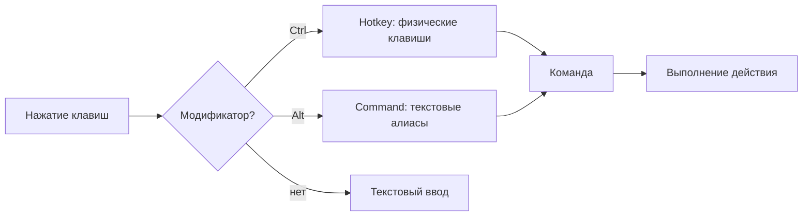
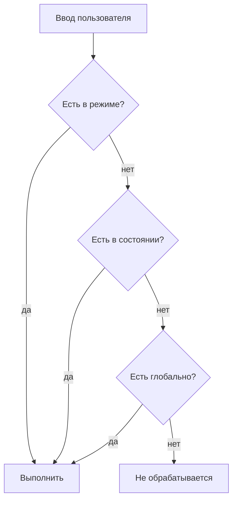

# Центральная система команд

> **О чём документ:** этот документ описывает центральную систему управления редактором — команды, алиасы, хоткеи, командную строку, аргументы с повторениями и строгую модель обработки конфликтов конфигурации. Документ фиксирует уже принятые проектные решения и является справочником при реализации.

---

## Содержание

1. [Обзор](#обзор)
2. [Команды](#команды)
3. [Алиасы](#алиасы)
4. [Хоткеи](#хоткеи)
5. [Независимость и приоритеты контекста](#независимость-и-приоритеты-контекста)
6. [Аргументы и повторения](#аргументы-и-повторения)
7. [Конфликты: строгая модель](#конфликты-строгая-модель)
8. [Стиль хоткеев](#стиль-хоткеев)
9. [Командная строка](#командная-строка)
10. [Пример конфигурации](#пример-конфигурации)

---

## Обзор

Любое действие пользователя в редакторе сводится к **команде**. Два режима ввода команд:

| Режим | Активация | Что записывает | Лейаут |
|---|---|---|---|
| **Hotkey** | Зажатие `Ctrl` | Физические клавиши: `vv`, `tl` | Независимый |
| **Command** | Зажатие `Alt` | Текстовые алиасы: `dd`, `35j`, `yy` | Зависимый |

Оба работают одинаково: зажал модификатор → набрал → отпустил → выполнилось. Enter — только для многошаговых команд, Escape — отмена.



---

## Команды

Команда — длинная **иерархическая строка**, разделённая `::`:

```
std::edit::move::up
std::edit::delete::line
std::file::save
```

Ключевые свойства:

- **Многословность намеренная.** По имени понятно, *что* делает команда, без обращения к документации.
- **Иерархия отражает принадлежность**: пространство (`std`), режим/домен (`edit`, `file`), действие (`move`, `delete`), уточнение (`up`, `line`).
- **Ручной набор не требуется.** Пользователь собирает команду из подсказок: автодополнение работает по уровням иерархии и учитывает текущий контекст (состояние/режим), предлагая только доступные команды.

Пример пошагового набора через автодополнение:

```text
> std::            ← подсказки: edit / file / search / view
> std::edit::      ← подсказки: move / delete / select / ...
> std::edit::move:: ← подсказки: up / down / word_start / ...
> std::edit::move::up⏎
```

---

## Алиасы

Алиас — короткое текстовое сокращение, вводимое в **командном режиме** (Alt):

| Алиас | Разворачивается в |
|---|---|
| `dd` | `std::edit::delete::line` |
| `yy` | `std::edit::copy::line` |
| `35j` | `std::edit::move::down` (с аргументом 35) |

Правила:

- **Alt — переключатель режима**, сам Alt команд не выполняет.
- Алиасы вводятся зажатием Alt и выполняются **при отпускании Alt** — ускоритель, не требует Enter.
- **Enter** нужен только для многошаговых команд.
- **Escape** — отмена, если уже что-то написал.
- **Пустой ввод** — если ничего не написал и отпустил Alt, ничего не происходит.
- **Невалидный ввод** — если написал несуществующий алиас, ничего не происходит.
- Числовой префикс перед буквами = количество повторений: `3dd` — удалить 3 строки.

---

## Хоткеи

Хоткей — **полноценный режим** (аналогичный командному), работающий с физическими клавишами:

| Параметр | Поведение |
|---|---|
| **Активация** | Зажатие Ctrl — переключатель режима |
| **Ввод** | Последовательности клавиш: `vv`, `tl`, `Ctrl+s` и т.д. |
| **Выполнение** | При отпускании Ctrl — ускоритель, не требует Enter |
| **Физические клавиши** | Записывает **физическое нажатие**, а не символ |
| **Лейаут** | Независимы от лейаута: `d` и `в` — одно и то же |
| **Контекст** | Зависит от текущего состояния и режима |

### Главное отличие от алиасов

| | Хоткеи (Ctrl) | Алиасы (Alt) |
|---|---|---|
| **Что записывает** | Физическую клавишу | Символ |
| **Лейаут** | Независимы от лейаута | Зависят от лейаута |
| **Пример** | `d` и `в` — одно и то же | `d` и `в` — разные символы |
| **Сценарий** | Быстрые комбинации в любом лейауте | Текстовые сокращения на своём языке |

Для хоткеев **не важно**, на каком лейауте вы набираете — `d` на английской и `в` на русской клавиатуре физически находятся в одном месте и обрабатываются одинаково.

---

## Макросы

Макрос — выполнение более одной команды через комбинацию клавиш в разной последовательности или конфигурации:

- Аналогично Хоткеям с уже описанной разницей.

---

## Независимость и приоритеты контекста

Алиасы и хоткеи — **два независимых механизма**:

- Настраиваются раздельно, в разных секциях конфига.
- Изменение алиаса не влияет на хоткеи и наоборот.

Оба механизма могут быть **контекстными** — привязанными к одному из трёх уровней:

| Уровень | Действует |
|---|---|
| **Режим** | Только внутри конкретного режима состояния |
| **Состояние** | Во всех режимах состояния |
| **Глобально** | Всегда |

Приоритет разрешения при нажатии клавиши / вводе алиаса — от узкого контекста к общему:



---

## Аргументы и повторения

Сигнатура команды включает **аргументы**. Поддерживается указание количества повторений — команда применяется несколько раз за одно выполнение:

| Ввод | Значение |
|---|---|
| `5dd` | Удалить 5 строк |
| `3std::edit::move::word_right` *(в командной строке)* | Сместиться на 3 слова вправо |

Повторение — универсальный механизм: там, где оно уместно по смыслу команды, оно работает одинаково и в командной строке, и как префикс перед хоткеем.

---

## Конфликты: строгая модель

**Дублирование алиаса или хоткея в общем и узком контексте — ошибка конфигурации.**

Пример конфликта: один и тот же хоткей объявлен и глобально, и внутри одного режима без изменения смысла — такая конфигурация не загружается.

Правила:

1. Запуск редактора со сломанным конфигом **не продолжается**.
2. Восстановление возможно **только средствами самого редактора**:
   - **(а)** Сообщение с точным указанием проблемы (файл, секция, конфликтующие записи) и способом запуска без конфига;
   - **(б)** Автозапуск на последней рабочей версии конфига + открытие сломанного конфига внутри редактора для исправления.
3. **CLI-флага «игнорировать ошибки» нет — намеренно.** Ошибку исправляют, а не обходят: обходной путь маскирует проблему и порождает невоспроизводимое поведение.

Подробнее о хранении последней рабочей версии — в [`config.md`](config.md).

---

## Стиль хоткеев

**Два режима ввода команд — Ctrl и Alt:**

| Режим | Модификатор | Что делает | Лейаут |
|---|---|---|---|
| **Hotkey** | Ctrl | Физические клавиши: `vv`, `tl`, `Ctrl+s` | Независимый |
| **Command** | Alt | Текстовые алиасы: `dd`, `35j`, `yy` | Зависимый |

Что это значит:

- ✅ **Хоткеи — через Ctrl**: физические клавиши, работают в любом лейауте одинаково.
- ✅ **Алиасы — через Alt**: текстовые сокращения, привязаны к символам.
- ❌ **F1/F2/F3 больше не переключают состояния** — переключение только через алиасы в командном режиме.

Ограничения по «железу» — осознанные:

| Решение | Пояснение |
|---|---|
| Целевая аудитория — клавиатуры **75%+** | F-ряд и модификаторы считаются доступными по умолчанию |
| Нет fallback-привязок для 60%-клавиатур | Отдельного механизма не существует; кому надо — переназначит через конфиг |

---

## Командный режим

Командный режим — Vim-стиль ввода алиасов:

| Функция | Поведение |
|---|---|
| Активация | Зажатие `Alt` |
| Ввод | Алиасы: `dd`, `35j`, `yy` и т.д. |
| Выполнение | При отпускании `Alt` |
| Длительность | Можно писать бесконечно долго, пока Alt зажата |
| Автодополнение | По иерархии команд, с учётом текущего состояния/режима |
| История | Навигация стрелками ↑/↓ |
| Подсветка синтаксиса | Ввод отображается с подсветкой структуры команды/алиаса/числа повторений |
| Подсказки | Выпадающий список вариантов под строкой ввода |

### Внешние shell-команды

Выполнение внешних shell-команд — **отдельный механизм** командного режима, не смешиваемый с внутренними командами и алиасами.

---

## Пример конфигурации

Фрагмент TOML-конфига с алиасами и хоткеями (полное описание формата — в [`config.md`](config.md)):

```toml
# --- Алиасы (командный режим: Alt + ввод букв) ---

[Aliases.global]
"w" = "std::file::save"
"q" = "std::file::close"

[Aliases.state.edit]
"dd" = "std::edit::delete::line"
"yy" = "std::edit::copy::line"

# --- Хоткеи (Ctrl + клавиша, доступны глобально) ---

[Hotkeys.global]
"Ctrl+s" = "std::file::save"

[Hotkeys.state.edit]
"Ctrl+z" = "std::edit::undo"
"Ctrl+y" = "std::edit::redo"

[Hotkeys.regime.edit.select]
"Shift+Left" = "std::edit::select::char_left"
"Shift+End" = "std::edit::select::line_end"
```

Вложенность в структуре `[Aliases.*]` / `[Hotkeys.*]` соответствует приоритету разрешения: `regime` → `state` → `global`.

---

## Связанные документы

- [`modes.md`](modes.md) — состояния и режимы, определяющие контекст команд.
- [`config.md`](config.md) — формат конфигурации, слои, восстановление после ошибок.
