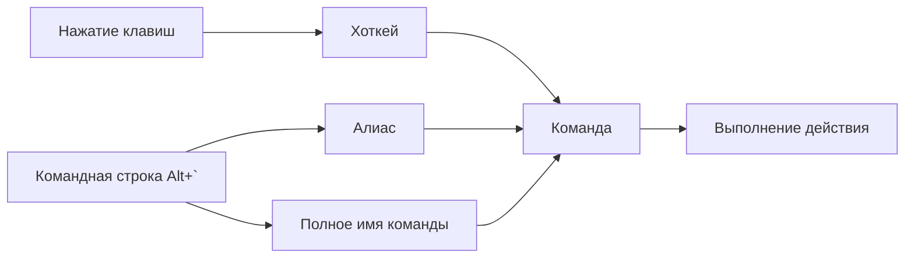
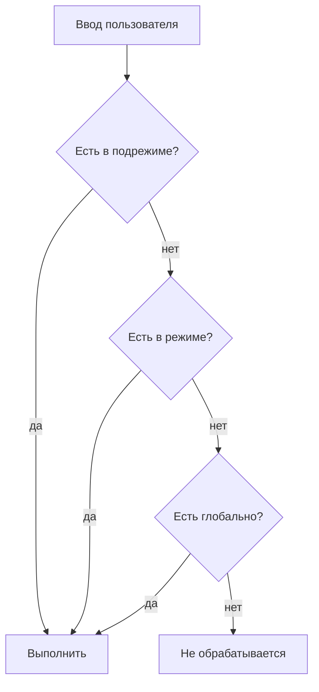

# Центральная система команд

> **О чём документ:** этот документ описывает центральную систему управления редактором — команды, алиасы, хоткеи, командную строку, аргументы с повторениями и строгую модель обработки конфликтов конфигурации. Документ фиксирует уже принятые проектные решения и является справочником при реализации.

---

## Содержание

1. [Обзор](#обзор)
2. [Команды](#команды)
3. [Алиасы](#алиасы)
4. [Хоткеи](#хоткеи)
5. [Независимость и приоритеты контекста](#независимость-и-приоритеты-контекста)
6. [Аргументы и повторения](#аргументы-и-повторения)
7. [Конфликты: строгая модель](#конфликты-строгая-модель)
8. [Стиль хоткеев](#стиль-хоткеев)
9. [Командная строка](#командная-строка)
10. [Пример конфигурации](#пример-конфигурации)

---

## Обзор

Любое действие пользователя в редакторе сводится к **команде**. Три способа вызвать команду:

| Способ | Куда вводится | Для чего предназначен |
|---|---|---|
| **Команда** | Командная строка (`Alt+``) | Полное имя, самодокументируемое |
| **Алиас** | Командная строка | Быстрый текстовый ввод |
| **Хоткей** | Прямое нажатие клавиш | Мгновенное выполнение без командной строки |



---

## Команды

Команда — длинная **иерархическая строка**, разделённая `::`:

```
std::edit::move::up
std::edit::delete::line
std::file::save
```

Ключевые свойства:

- **Многословность намеренная.** По имени понятно, *что* делает команда, без обращения к документации.
- **Иерархия отражает принадлежность**: пространство (`std`), режим/домен (`edit`, `file`), действие (`move`, `delete`), уточнение (`up`, `line`).
- **Ручной набор не требуется.** Пользователь собирает команду из подсказок: автодополнение работает по уровням иерархии и учитывает текущий контекст (режим/подрежим), предлагая только доступные команды.

Пример пошагового набора через автодополнение:

```text
> std::            ← подсказки: edit / file / search / view
> std::edit::      ← подсказки: move / delete / select / ...
> std::edit::move:: ← подсказки: up / down / word_start / ...
> std::edit::move::up⏎
```

---

## Алиасы

Алиас — короткое текстовое сокращение для командной строки:

| Алиас | Разворачивается в |
|---|---|
| `dd` | `std::edit::delete::line` |
| `w` | `std::file::save` *(пример)* |

Правила:

- Алиасы существуют **только для командной строки**.
- Алиасы **не привязаны к клавишам** и никогда не участвуют в трансляции нажатий — для этого есть хоткеи.

---

## Хоткеи

Хоткей — прямое сопоставление комбинации клавиш команде:

- Нажатие выполняет команду **минуя командную строку**.
- Один хоткей → одна команда (с фиксированными аргументами, см. [ниже](#аргументы-и-повторения)).
- Все хоткеи переназначаемы через конфигурацию.

---

## Независимость и приоритеты контекста

Алиасы и хоткеи — **два независимых механизма**:

- Настраиваются раздельно, в разных секциях конфига.
- Изменение алиаса не влияет на хоткеи и наоборот.

Оба механизма могут быть **контекстными** — привязанными к одному из трёх уровней:

| Уровень | Действует |
|---|---|
| **Подрежим** | Только внутри конкретного подрежима |
| **Режим** | Во всех подрежимах режима |
| **Глобально** | Всегда |

Приоритет разрешения при нажатии клавиши / вводе алиаса — от узкого контекста к общему:



---

## Аргументы и повторения

Сигнатура команды включает **аргументы**. Поддерживается указание количества повторений — команда применяется несколько раз за одно выполнение:

| Ввод | Значение |
|---|---|
| `5dd` | Удалить 5 строк |
| `3std::edit::move::word_right` *(в командной строке)* | Сместиться на 3 слова вправо |

Повторение — универсальный механизм: там, где оно уместно по смыслу команды, оно работает одинаково и в командной строке, и как префикс перед хоткеем.

---

## Конфликты: строгая модель

**Дублирование алиаса или хоткея в общем и узком контексте — ошибка конфигурации.**

Пример конфликта: один и тот же хоткей объявлен и глобально, и внутри одного режима без изменения смысла — такая конфигурация не загружается.

Правила:

1. Запуск редактора со сломанным конфигом **не продолжается**.
2. Восстановление возможно **только средствами самого редактора**:
   - **(а)** Сообщение с точным указанием проблемы (файл, секция, конфликтующие записи) и способом запуска без конфига;
   - **(б)** Автозапуск на последней рабочей версии конфига + открытие сломанного конфига внутри редактора для исправления.
3. **CLI-флага «игнорировать ошибки» нет — намеренно.** Ошибку исправляют, а не обходят: обходной путь маскирует проблему и порождает невоспроизводимое поведение.

Подробнее о хранении последней рабочей версии — в [`config.md`](config.md).

---

## Стиль хоткеев

**База — стандартные сочетания:** `Ctrl+…`, `Alt+…`, `Shift+…`, F-ряд.

Что это значит:

- ❌ **НЕ vim/helix-стиль** с чистыми последовательностями букв (`dd`, `gg`, `ciw`). Причины:
  - последовательности букв захватывают алфавит и делают обычный ввод невозможным без модальности;
  - модальность тянет за собой усложнение модели состояний и обучения пользователей.
- ✅ Модификаторы оставляют алфавит свободным для прямого ввода текста.

Ограничения по «железу» — осознанные:

| Решение | Пояснение |
|---|---|
| Целевая аудитория — клавиатуры **75%+** | F-ряд и модификаторы считаются доступными по умолчанию |
| Нет fallback-привязок для 60%-клавиатур | Отдельного механизма не существует; кому надо — переназначит через конфиг |

---

## Командная строка

Вызов — **`Alt+``** (переназначаемо). Возможности:

| Функция | Поведение |
|---|---|
| Выполнение команд | Полные имена команд и алиасы |
| Автодополнение | По иерархии команд, с учётом текущего режима/подрежима |
| История | Навигация стрелками ↑/↓ |
| Подсветка синтаксиса | Ввод отображается с подсветкой структуры команды/алиаса/числа повторений |
| Подсказки | Выпадающий список вариантов под строкой ввода |

### Внешние shell-команды

Выполнение внешних shell-команд — **отдельный режим** командной строки, не смешиваемый с внутренними командами и алиасами.

---

## Пример конфигурации

Фрагмент TOML-конфига с алиасами и хоткеями (полное описание формата — в [`config.md`](config.md)):

```toml
# --- Алиасы (только для командной строки) ---

[aliases.global]
w   = "std::file::save"
q   = "std::file::close"

[aliases.mode.edit]
dd  = "std::edit::delete::line"
yy  = "std::edit::copy::line"

# --- Хоткеи (прямое выполнение, минуя командную строку) ---

[hotkeys.global]
"Ctrl+s"     = "std::file::save"
"Alt+`"      = "std::ui::commandline::open"

[hotkeys.mode.edit]
"Ctrl+z"     = "std::edit::undo"
"Ctrl+y"     = "std::edit::redo"
"Alt+Up"     = "std::edit::move::up"
"Alt+Down"   = "std::edit::move::down"

[hotkeys.submode.edit.select]
"Shift+Left" = "std::edit::select::char_left"
"Shift+End"  = "std::edit::select::line_end"
```

Уровни вложенности `[aliases.*]` / `[hotkeys.*]` соответствуют приоритету разрешения: `submode` → `mode` → `global`.

---

## Связанные документы

- [`modes.md`](modes.md) — режимы и подрежимы, определяющие контекст команд.
- [`config.md`](config.md) — формат конфигурации, слои, восстановление после ошибок.
