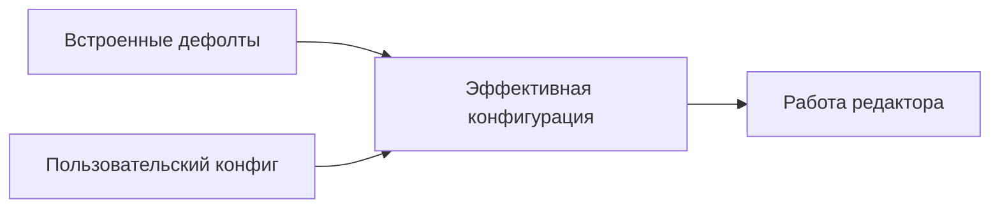

# Конфигурация

> **О чём документ:** этот документ описывает систему конфигурации редактора — формат RON, перечень настраиваемых параметров, слои конфигурации, строгую модель обработки ошибок и механизм хранения последней рабочей версии конфига. Документ фиксирует уже принятые проектные решения.

---

## Содержание

1. [Формат и что настраивается](#формат-и-что-настраивается)
2. [Слои конфигурации](#слои-конфигурации)
3. [Строгая модель ошибок](#строгая-модель-ошибок)
4. [Хранение последней рабочей версии](#хранение-последней-рабочей-версии)
5. [Миграция формата между версиями](#миграция-формата-между-версиями)
6. [Пример полного конфига](#пример-полного-конфига)

---

## Формат и что настраивается

Конфигурация — единый файл в формате **RON** (Rusty Object Notation).

### Modes

Секция `Modes` содержит основные настройки редактора, разбитые на подсекции.

#### General

Общие настройки редактора.

| Параметр | Тип | Описание |
|---|---|---|
| `color_modes` | `bool` | Цветовая индикация текущего состояния/режима |
| `auto_format` | `bool` | Автоматическое форматирование при сохранении |
| `insert_final_newline` | `bool` | Вставка пустой строки в конце файла при сохранении |

#### Editor

Настройки поведения редактора.

**Мышь:**

| Параметр | Тип | Описание |
|---|---|---|
| `mouse_mode` | `bool` | Включение поддержки мыши |
| `middle_click_paste` | `bool` | Вставка текста по нажатию средней кнопки мыши |
| `step_scroll_lines` | `u8` | Количество строк, прокручиваемых за одно действие колёсика мыши |

**Параметры отображения и поведения:**

| Параметр | Тип | Описание |
|---|---|---|
| `cursorline` | `bool` | Подсветка текущей строки |
| `cursorcolumn` | `bool` | Подсветка текущей колонки |
| `end_padding` | `u8` | Отступ от последнего видимого символа до правого края экрана |
| `shell_os` | `Enum` | Определяет shell для внешних команд: `"Unix"` → `sh -c`, `"Windows"` → `cmd /C` |
| `line_number` | `Enum` | Отображение номеров строк: `"absolute"` — абсолютные, `"relative"` — относительные |
| `continue_comments` | `bool` | При создании новой строки в области комментария — продолжать комментарий |
| `auto_completion` | `bool` | Автодополнение при вводе текста |
| `path_completion` | `(files: bool, directory: bool)` | Автодополнение путей: `files` — файлы, `directory` — директории |
| `max_text_width` | `u8` | Максимальная ширина текста (рекомендуемая длина строки) |

### Themes

Секция `Themes` определяет параметры темы оформления.

| Параметр | Тип | Описание |
|---|---|---|
| `path` | `String` | Путь к директории с файлами темы |

---

## Слои конфигурации

Конфигурация собирается из двух слоёв:



| Слой | Приоритет | Назначение |
|---|---|---|
| Встроенные дефолты | низший | Редактор работоспособен без конфига вообще |
| Пользовательский конфиг | **высший** | Переопределяет любые дефолты по одному, а не целиком |

Переопределение **точечное**: пользовательский конфиг заменяет только те значения, которые явно указаны; остальное берётся из дефолтов.

---

## Строгая модель ошибок

**Сломанный конфиг = запуск не продолжается.** Это осознанное решение: редактор не «чинит за пользователя» и не запускается с частично применённой конфигурацией.

Восстановление — средствами самого редактора:

1. **Точное сообщение о проблеме**: какой файл, какая секция/строка, что именно конфликтует — плюс способ запуска **без конфига** (на чистых дефолтах).
2. **Автозапуск на последней рабочей версии конфига**: редактор стартует на сохранённой копии последней удачной конфигурации и **открывает сломанный конфиг внутри себя** для исправления.

**CLI-флага игнорирования ошибок нет — намеренно.** Ошибку исправляют, а не обходят: флаг маскировал бы проблему и приводил к невоспроизводимому поведению («у меня работает / у него нет»).

Пример сообщения при старте:

```text
Ошибка конфигурации: неизвестный параметр "shell_oz" в секции Editor
  файл:    ~/.config/my-editor/config.ron
  запись:  Modes.Editor.shell_oz
  ошибка:  допустимое имя — "shell_os"

Запуск остановлен.
Варианты:
  * запустить без конфига:  my-editor --no-config
  * нажать Enter — продолжить на последней рабочей версии конфига
    и открыть сломанный файл для исправления
```

---

## Хранение последней рабочей версии

Внутренний механизм редактора:

- после **каждого успешного** применения конфига его валидированная копия сохраняется во внутреннем хранилище;
- хранилище обслуживается самим редактором и не является частью пользовательского конфига;
- при ошибке загрузки текущего конфига используется сохранённая копия (см. [Строгую модель ошибок](#строгая-модель-ошибок)).

---

## Миграция формата между версиями

> **Заметка о будущем.** Автообновление конфигов старых форматов до актуального (переименование ключей, изменение структуры секций) — задача будущих этапов разработки. В структуре конфигурации и её загрузке заложено место для этого механизма: версия формата будет фиксироваться в конфиге и проверяться при загрузке до применения остальных слоёв. Пока миграция не реализована.

---

## Пример полного конфига

```ron
// ---
// my-editor — пользовательская конфигурация
// Слои: встроенные дефолты <- этот файл (пользовательский имеет приоритет)
// ---

Modes(
    General(
        color_modes: true,
        auto_format: true,
        insert_final_newline: true,
    ),
    Editor(
        // mouse settings
        mouse_mode: true,
        middle_click_paste: true,
        step_scroll_lines: 3,

        // space edit settings
        cursorline: true,
        cursorcolumn: false,
        end_padding: 1,
        shell_os: "Unix",
        line_number: "absolute",
        continue_comments: true,
        auto_completion: true,
        path_completion: (files: true, directory: true),
        max_text_width: 80,
    ),
),

Themes(
    path: "~/.config/my-editor/themes",
)
```

---

## Связанные документы

- [`command-system.md`](command-system.md) — команды, алиасы, хоткеи, конфликты привязок.
- [`modes.md`](modes.md) — состояния и режимы, контексты привязок.
