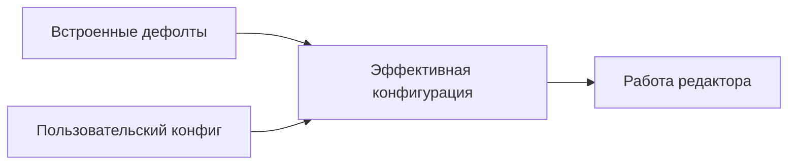

# Конфигурация

> **О чём документ:** этот документ описывает систему конфигурации редактора — формат TOML, перечень настраиваемых параметров, слои конфигурации, строгую модель обработки ошибок и механизм хранения последней рабочей версии конфига. Документ фиксирует уже принятые проектные решения.

---

## Содержание

1. [Формат и что настраивается](#формат-и-что-настраивается)
2. [Слои конфигурации](#слои-конфигурации)
3. [Строгая модель ошибок](#строгая-модель-ошибок)
4. [Хранение последней рабочей версии](#хранение-последней-рабочей-версии)
5. [Миграция формата между версиями](#миграция-формата-между-версиями)
6. [Пример полного конфига](#пример-полного-конфига)

---

## Формат и что настраивается

Конфигурация — единый файл в формате **TOML**.

| Группа параметров | Что включает |
|---|---|
| Привязки хоткеев | Сопоставления клавиш командам, контекстные (подрежим/режим/глобально) — см. [`command-system.md`](command-system.md) |
| Алиасы | Текстовые сокращения для командной строки |
| Тема / цвета | Цветовая схема интерфейса и подсветки |
| Путь к файлу локализации | Расположение файла переводов интерфейса |
| Отключение обучения | Отключение обучающих подсказок для опытных пользователей |
| Параметры undo-правил | Таймаут группировки изменений (мс), символы-разделители |
| Поведение вкладок | Правила открытия/закрытия вкладок |

### Undo-правила

| Параметр | Смысл |
|---|---|
| Таймаут группировки (мс) | Изменения, сделанные в пределах таймаута, объединяются в один шаг undo |
| Символы-разделители | Ввод этих символов принудительно завершает группу (например, пробел или пунктуация) |

---

## Слои конфигурации

Конфигурация собирается из двух слоёв:



| Слой | Приоритет | Назначение |
|---|---|---|
| Встроенные дефолты | низший | Редактор работоспособен без конфига вообще |
| Пользовательский конфиг | **высший** | Переопределяет любые дефолты по одному, а не целиком |

Переопределение **точечное**: пользовательский конфиг заменяет только те значения, которые явно указаны; остальное берётся из дефолтов.

---

## Строгая модель ошибок

**Сломанный конфиг = запуск не продолжается.** Это осознанное решение: редактор не «чинит за пользователя» и не запускается с частично применённой конфигурацией.

Восстановление — средствами самого редактора:

1. **Точное сообщение о проблеме**: какой файл, какая секция/строка, что именно конфликтует — плюс способ запуска **без конфига** (на чистых дефолтах).
2. **Автозапуск на последней рабочей версии конфига**: редактор стартует на сохранённой копии последней удачной конфигурации и **открывает сломанный конфиг внутри себя** для исправления.

**CLI-флага игнорирования ошибок нет — намеренно.** Ошибку исправляют, а не обходят: флаг маскировал бы проблему и приводил к невоспроизводимому поведению («у меня работает / у него нет»).

Пример сообщения при старте:

```text
Ошибка конфигурации: дубликат хоткея "Ctrl+s"
  файл:    ~/.config/my-editor/config.toml
  запись:  [hotkeys.global] "Ctrl+s" -> std::file::save
  конфликт: тот же хоткей уже назначен std::file::save_as

Запуск остановлен.
Варианты:
  * запустить без конфига:  my-editor --no-config
  * нажать Enter — продолжить на последней рабочей версии конфига
    и открыть сломанный файл для исправления
```

---

## Хранение последней рабочей версии

Внутренний механизм редактора:

- после **каждого успешного** применения конфига его валидированная копия сохраняется во внутреннем хранилище;
- хранилище обслуживается самим редактором и не является частью пользовательского конфига;
- при ошибке загрузки текущего конфига используется сохранённая копия (см. [Строгую модель ошибок](#строгая-модель-ошибок)).

---

## Миграция формата между версиями

> **Заметка о будущем.** Автообновление конфигов старых форматов до актуального (переименование ключей, изменение структуры секций) — задача будущих этапов разработки. В структуре конфигурации и её загрузке заложено место для этого механизма: версия формата будет фиксироваться в конфиге и проверяться при загрузке до применения остальных слоёв. Пока миграция не реализована.

---

## Пример полного конфига

```toml
# ============================================================
# my-editor — пользовательская конфигурация
# Слои: встроенные дефолты <- этот файл (пользовательский имеет приоритет)
# ============================================================

[meta]
# Версия формата конфигурации (используется будущим механизмом миграции)
format_version = 1

# --- Внешний вид ---

[theme]
name        = "dark-default"
background  = "#1e1e2e"
foreground  = "#cdd6f4"
accent      = "#89b4fa"
error       = "#f38ba8"

# --- Локализация ---

[i18n]
path = "~/.config/my-editor/i18n/ru.toml"

# --- Обучение ---

[learning]
enabled = false   # отключить обучающие подсказки

# --- Undo-правила ---

[undo]
grouping_timeout_ms = 500          # изменения ближе 500 мс склеиваются в один шаг undo
separators          = [" ", ",", ".", ";", ":", "\n"]  # ввод этих символов завершает группу

# --- Вкладки ---

[tabs]
show_on_start     = false
close_with_editor = false          # вкладки переживают перезапуск редактора

# --- Алиасы (только командная строка) ---

[aliases.global]
w  = "std::file::save"
q  = "std::file::close"

[aliases.mode.edit]
dd = "std::edit::delete::line"

# --- Хоткеи (приоритет разрешения: подрежим -> режим -> глобально) ---

[hotkeys.global]
"Alt+`"  = "std::ui::commandline::open"
"F1"     = "std::mode::edit"
"F2"     = "std::mode::file"
"F3"     = "std::mode::search"

[hotkeys.mode.edit]
"Ctrl+s" = "std::file::save"
"Ctrl+z" = "std::edit::undo"
"Ctrl+y" = "std::edit::redo"

[hotkeys.submode.edit.select]
"Shift+Left" = "std::edit::select::char_left"
"Shift+End"  = "std::edit::select::line_end"

# --- Подрежимы: переключение Alt+1, Alt+2, ... ---

[submode_switches]
"Alt+1" = "std::mode::edit::input"
"Alt+2" = "std::mode::edit::view"
"Alt+3" = "std::mode::edit::select"
"Alt+4" = "std::mode::edit::replace_char"
```

---

## Связанные документы

- [`command-system.md`](command-system.md) — команды, алиасы, хоткеи, конфликты привязок.
- [`modes.md`](modes.md) — режимы и подрежимы, контексты привязок.
