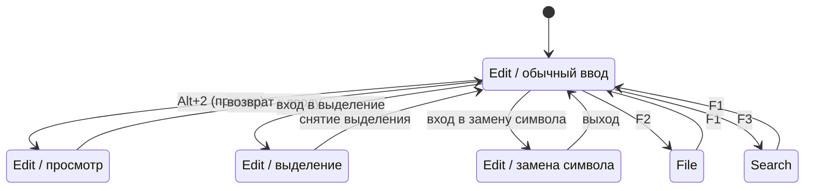

# Режимы

> **О чём документ:** этот документ описывает систему режимов и подрежимов редактора — три основных режима, ориентированных на задачи, их подрежимы, универсальную логику курсора, концептуальную машину состояний и индикацию текущего режима. Документ фиксирует уже принятые проектные решения.

---

## Содержание

1. [Принцип: режимы ориентированы на задачи](#принцип-режимы-ориентированы-на-задачи)
2. [Три основных режима](#три-основных-режима)
3. [Переключение режимов](#переключение-режимов)
4. [Подрежимы режима Edit](#подрежимы-режима-edit)
5. [Универсальная логика курсора](#универсальная-логика-курсора)
6. [Машина состояний](#машина-состояний)
7. [Индикация режима](#индикация-режима)

---

## Принцип: режимы ориентированы на задачи

Режимы группируют действия по **задаче**, над которой работает пользователь, а не по типу нажатий. В каждый момент времени активен один основной режим; внутри него — один подрежим. Контекст «режим + подрежим» определяет, как транслируются клавиши и какие команды доступны (см. [`command-system.md`](command-system.md)).

Это **не vim-модальность**: модальные последовательности букв в редакторе не используются, обычный ввод текста не требует смены режима (см. [Стиль хоткеев](command-system.md#стиль-хоткеев) в документе системы команд).

---

## Три основных режима

| Режим | Клавиша | Зона ответственности |
|---|---|---|
| **Edit** | `F1` | Ввод текста, навигация, выделение, удаление, замена символа |
| **File** | `F2` | Создание / открытие / перемещение / сохранение файлов, Git-интеграция |
| **Search** | `F3` | Поиск: обычный текст, регулярные выражения, фильтры; точечная и глобальная замена в едином интерфейсе |

### Edit

Основной рабочий режим: всё, что связано с содержимым буфера.

- ввод текста;
- навигация;
- выделение;
- удаление;
- замена символа.

### File

Работа с файловой системой и VCS из редактора.

- создание, открытие, перемещение, сохранение файлов;
- Git-интеграция.

### Search

Единый интерфейс для поиска и замены:

- поиск обычного текста;
- поиск по регулярным выражениям;
- фильтры;
- точечная замена (по подтверждению) и глобальная замена — в одном интерфейсе, без переключения между разными диалогами.

---

## Переключение режимов

| Действие | Привязка по умолчанию |
|---|---|
| Переключение основных режимов | `F1` / `F2` / `F3` |
| Переключение подрежимов | `Alt+1`, `Alt+2`, … |

**Все привязки переназначаемы** в конфигурации ([`config.md`](config.md)). Значения выше — дефолты, а не фиксированные константы.

---

## Подрежимы режима Edit

| Подрежим | Назначение |
|---|---|
| Обычный ввод | Стандартный ввод текста с курсором |
| Просмотр | Только навигация; ввод не изменяет буфер |
| Выделение | Расширение выделения движениями курсора |
| Замена символа | Вводимый текст **сразу заменяет символ под курсором**, курсор сдвигается вперёд |
| … | Список открыт к расширению |

Подрежимы есть и у других режимов; приведённый список иллюстрирует подход: узкая задача — отдельный подрежим со своим контекстом команд и хоткеев.

---

## Универсальная логика курсора

Логика перемещения курсора **едина для всех режимов**, где применима (`per-режим`):

| Движение | Единицы |
|---|---|
| По символам/буквам | влево / вправо |
| По словам | к началу слова / к концу слова |
| По строкам | вверх / вниз |
| По строке | к началу строки / к концу строки |

Правила:

- Набор движений одинаков во всех режимах — пользователь учится один раз.
- Там, где движение допускает повторение, поддерживается **количество повторений** (`5×вверх`, `3×слово вправо`) — единый механизм с системой команд (см. [Аргументы и повторения](command-system.md#аргументы-и-повторения)).

---

## Машина состояний

Концептуально состояние редактора — это пара:

```
(основной режим, подрежим) → контекст трансляции клавиш + набор доступных команд
```



Свойства машины состояний:

1. **Один активный контекст.** В каждый момент трансляция нажатий выполняется ровно одним контекстом `(режим, подрежим)` — неоднозначности нет.
2. **Контекст определяет разрешение команд.** Автодополнение в командной строке и приоритет хоткеев зависят от текущего контекста (приоритет: подрежим → режим → глобально).
3. **Переходы явные.** Смена режима/подрежима происходит только через назначенные команды или привязки, а не скрыто от пользователя.

---

## Индикация режима

Текущий режим и подрежим отображаются в **однострочном баре**.

- Никаких отдельных панелей, вкладок-индикаторов или всплывающих плашек — минимализм.
- Бар всегда показывает достаточный минимум: где я и в каком я контексте.

---

## Связанные документы

- [`command-system.md`](command-system.md) — команды, алиасы, хоткеи, командная строка.
- [`config.md`](config.md) — настройка привязок переключения режимов.
