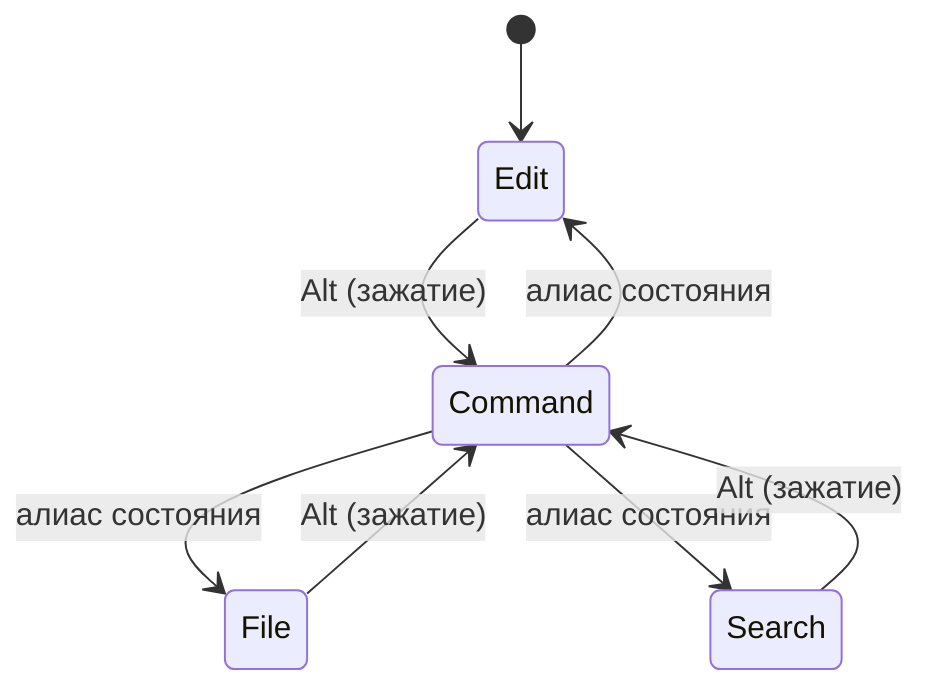
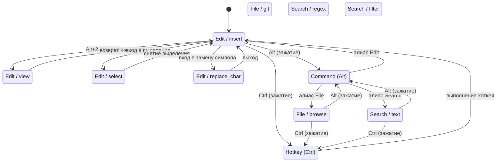

# Состояния и режимы

> **О чём документ:** этот документ описывает модель управления редактором — четыре глобальных состояния, режимы внутри них, логику переключения, командный режим (Alt), хоткеи (Ctrl) и лидера (пробел). Документ фиксирует уже принятые проектные решения.

---

## Содержание

1. [Два уровня управления](#два-уровня-управления)
2. [Глобальные состояния](#глобальные-состояния)
3. [Режимы внутри состояний](#режимы-внутри-состояний)
4. [Командный режим (Alt)](#командный-режим-alt)
5. [Хоткеи (Ctrl)](#хоткеи-ctrl)
6. [Лидер-кавиша (пробел)](#лидер-кавиша-пробел)
7. [Переключение между состояниями](#переключение-между-состояниями)
8. [Логика курсора](#логика-курсора)
9. [Машина состояний](#машина-состояний)
10. [Индикация](#индикация)

---

## Два уровня управления

Управление редактором организовано на двух уровнях:

| Уровень | Что это | Пример |
|---|---|---|
| **Глобальное состояние** | Определяет контекст: что делают клавиши | Edit, File, Search, Command |
| **Режим** | Узкое разделение внутри состояния | insert, select, view, replace_char |

Одновременно активно **одно состояние** и **один режим** внутри него.

---

## Глобальные состояния

Всего **4 глобальных состояния**:

| Состояние | Назначение | Активация по умолчанию |
|---|---|---|
| **Edit** | Ввод текста, навигация, выделение, удаление | Да (состояние по умолчанию) |
| **File** | Создание / открытие / перемещение / сохранение файлов, Git | — |
| **Search** | Поиск и замена (текст, regex, фильтры) | — |
| **Command** | Выполнение алиасов ( Vim-стиль: `dd`, `35j`) | Зажатие Alt |

### Edit

Основное рабочее состояние. Всё, что связано с содержимым буфера:

- ввод текста;
- навигация;
- выделение;
- удаление;
- замена символа.

### File

Работа с файловой системой и VCS из редактора:

- создание, открытие, перемещение, сохранение файлов;
- Git-интеграция.

### Search

Единый интерфейс для поиска и замены:

- поиск обычного текста;
- поиск по регулярным выражениям;
- фильтры;
- точечная замена (по подтверждению) и глобальная замена — в одном интерфейсе.

### Command

Командный режим для ввода **текстовых алиасов** (Vim-стиль):

- **активируется зажатием Alt**;
- ввод алиасов: `dd` (удалить строку), `35j` (переместиться на 35 строк вниз);
- **выполняется при отпускании Alt**;
- пока Alt зажата, можно писать сколько угодно долго;
- **зависит от лейаута**: `d` и `в` — разные символы.

Командный режим также используется для **переключения между глобальными состояниями** (см. [Переключение между состояниями](#переключение-между-состояниями)).

### Hotkey

Режим хоткеев для ввода **физических клавиш**:

- **активируется зажатием Ctrl**;
- ввод последовательностей: `vv`, `tl`, `Ctrl+s` и т.д.;
- **выполняется при отпускании Ctrl**;
- пока Ctrl зажата, можно писать сколько угодно долго;
- **независим от лейаута**: `d` и `в` — одно и то же физическое нажатие.

---

## Режимы внутри состояний

Каждое состояние может иметь **режимы** — узкие разделения с конкретным контекстом команд.

**Правило именования:** название режима должно содержать **минимум 2 буквы**. Это освобождает однобуквенные клавиши для быстрых алиасов в командном режиме.

### Edit: режимы

| Режим | Назначение |
|---|---|
| **insert** | Стандартный ввод текста с курсором (по умолчанию) |
| **view** | Только навигация; ввод не изменяет буфер |
| **select** | Расширение выделения движениями курсора |
| **replace_char** | Вводимый текст **сразу заменяет символ под курсором**, курсор сдвигается вперёд |

Режимы списка открыт к расширению — узкая задача, отдельный режим со своим контекстом команд и хоткеев.

### File: режимы

| Режим | Назначение |
|---|---|
| **browse** | Навигация по файловой системе |
| **git** | Git-операции (коммит, дифф, ветки) |

### Search: режимы

| Режим | Назначение |
|---|---|
| **text** | Обычный поиск по тексту |
| **regex** | Поиск по регулярным выражениям |
| **filter** | Фильтрация по критериям |

### Command: режимы

Командный режим **не имеет внутренних режимов** — он линеен: ввод алиаса → отпускание Alt → выполнение.

---

## Командный режим (Alt)

Командный режим — Vim-стиль ввода алиасов:

| Параметр | Поведение |
|---|---|
| **Активация** | Зажатие Alt — переключатель режима, сам Alt команд не выполняет |
| **Ввод** | Алиасы: `dd`, `35j`, `yy` и т.д. |
| **Выполнение** | При отпускании Alt — ускоритель, не требует Enter |
| **Enter** | Нужен только для многошаговых команд |
| **Отмена** | Escape — если уже что-то написал |
| **Пустой ввод** | Если ничего не написал и отпустил Alt — ничего не происходит |
| **Невалидный ввод** | Если написал несуществующий алиас — ничего не происходит |
| **Длительность** | Можно писать бесконечно долго, пока Alt зажата |

### Правила алиасов в командном режиме

| Правило | Смысл |
|---|---|
| **Числовой префикс** | Повторение команды: `3dd` — удалить 3 строки, `10j` — вниз на 10 строк |
| **Выполнение при отпускании** | Алиас накапливается и исполняется целиком при отпускании Alt |
| **Enter для сложных команд** | Многошаговые алиасы требуют подтверждения Enter |

### Примеры

| Ввод | Действие |
|---|---|
| `dd` + отпускание Alt | Удалить текущую строку |
| `3dd` + отпускание Alt | Удалить 3 строки |
| `yy` + отпускание Alt | Скопировать строку |
| `35j` + отпускание Alt | Переместиться на 35 строк вниз |
| `p` + отпускание Alt | Вставить из буфера обмена |

---

## Хоткеи (Ctrl)

Хоткеи — **полноценный режим**, аналогичный командному, но с принципиально другим подходом к вводу:

| Параметр | Поведение |
|---|---|
| **Активация** | Зажатие Ctrl — переключатель режима |
| **Ввод** | Последовательности клавиш: `vv`, `tl`, `Ctrl+s` и т.д. |
| **Выполнение** | При отпускании Ctrl — ускоритель, не требует Enter |
| **Enter** | Нужен только для многошаговых команд |
| **Отмена** | Escape — если уже что-то написал |
| **Физические клавиши** | Записывает **физическое нажатие**, а не символ |

### Главное отличие от алиасов

| | Хоткеи (Ctrl) | Алиасы (Alt) |
|---|---|---|
| **Что записывает** | Физическую клавишу | Символ |
| **Лейаут** | Независимы от лейаута | Зависят от лейаута |
| **Пример** | `d` и `в` — одно и то же | `d` и `в` — разные символы |
| **Сценарий** | Быстрые комбинации в любом лейауте | Текстовые сокращения на своём языке |

Для хоткеев **не важно**, на каком лейауте вы набираете — `d` на английской и `в` на русской клавиатуре физически находятся в одном месте и обрабатываются одинаково.

### Приоритет разрешения

```
Ctrl + клавиша → поиск в текущем режиме → в текущем состоянии → глобально
```

Хоткеи **перекрывают** ввод текста: `Ctrl+s` сохраняет файл, а не печатает `s`.

### Переиспользование хоткеев

Разные состояния могут иметь **одинаковые хоткеи** с разным поведением. Например, `Ctrl+s` может сохранять и в Edit, и в File — контекст определяет, что именно сохраняется. Глобальные хоткеи работают одинаково во всех состояниях.

---

## Лидер-кавиша (пробел)

Пробел — **лидер-кавиша**, которая удваивает количество доступных комбинаций:

| Параметр | Поведение |
|---|---|
| **Клавиша** | Пробел |
| **Механика** | Пробел + комбинация = альтернативная команда |
| **Назначение** | Расширение пространства имён для хоткеев |

### Логика

Пробел как лидер — стандартный подход в Modal-редакторах. Поскольку пробел и так вставляет символ, его использование как модификатора не конфликтует с вводом: в режиме insert пробел вставляет пробел, а в других контекстах может быть лидером.

> **Примечание:** точная механика лидера (задержка, комбинации) определяется при реализации. Ключевое решение зафиксировано: пробел — лидер.

---

## Переключение между состояниями

Переключение между глобальными состояниями происходит **через командный режим**:



### Правила переключения

| Правило | Смысл |
|---|---|
| **Через Command** | Переключение только через алиасы в командном режиме |
| **Нет прямых хоткеев** | F1/F2/F3 больше не переключают состояния |
| **Edit — по умолчанию** | При старте редактора активно состояние Edit |

---

## Логика курсора

Логика перемещения курсора **едина для всех состояний**, где применима:

| Движение | Единицы |
|---|---|
| По символам/буквам | влево / вправо |
| По словам | к началу слова / к концу слова |
| По строкам | вверх / вниз |
| По строке | к началу строки / к концу строки |

### Правила

- Набор движений одинаков во всех состояниях — пользователь учится один раз.
- Поддерживается **количество повторений** (`5×вверх`, `3×слово вправо`) — единый механизм с командным режимом.

---

## Машина состояний

Концептуально состояние редактора — это пара:

```
(глобальное состояние, режим) → контекст трансляции клавиш + набор доступных команд
```



### Свойства

1. **Один активный контекст.** В каждый момент трансляция нажатий выполняется ровно одним контекстом `(состояние, режим)`.
2. **Контекст определяет разрешение команд.** Хоткеи и ввод зависят от текущего контекста.
3. **Переходы явные.** Смена состояния/режима происходит только через назначенные команды или привязки.

---

## Индикация

Текущее состояние и режим отображаются в **однострочном баре**:

- Никаких отдельных панелей, вкладок-индикаторов или всплывающих плашек — минимализм.
- Бар всегда показывает достаточный минимум: где я и в каком контексте.

---

## Кривая обучения

Модель состояний и режимов спроектирована для **низкой кривой обучения**:

- Нет одного перегруженного режима с миллиардом хоткеев — каждое состояние и режим содержат только релевантные команды.
- Глобальные хоткеи работают одинаково во всех состояниях — не нужно переучиваться.
- Разные состояния могут переиспользовать одни и те же хоткеи с разным контекстным поведением.
- Встроенное обучение настраивает редактор под пользователя: при изучении команды предлагается назначить алиас или хоткей, запись идёт в конфиг. К концу курса редактор полностью персонализирован.

---

## Связанные документы

- [`command-system.md`](command-system.md) — команды, алиасы, хоткеи, командный режим.
- [`config.md`](config.md) — настройка привязок переключения состояний и режимов.
