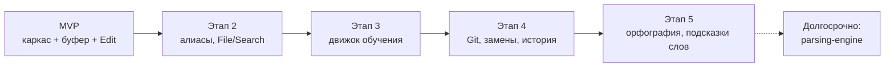

# MVP и roadmap

> **О документе:** определяет, что входит в MVP редактора и какие этапы развития следуют за ним. Для каждого этапа зафиксированы цель, состав работ и критерий готовности. Документ — ориентир для планирования: фича не «сделана», пока не выполнен критерий готовности её этапа.
>
> См. также: [architecture.md](architecture.md) — архитектура; [philosophy.md](philosophy.md) — философия.

---

## Этапы

---

## MVP

**Цель:** минимальный *usable*-редактор — в нём уже можно реально писать код.

| # | Компонент | Что входит |
|---|---|---|
| 1 | Каркас TUI | событийный цикл, инкрементальный рендер, однострочный бар |
| 2 | Rope-буфер | вставка/удаление/чтение через rope |
| 3 | Состояние Edit | навигация, ввод, удаление, выделение |
| 4 | Командный режим | алиасы (Alt) + автодополнение по иерархии |
| 5 | Конфиг | RON-конфиг с хоткеями |
| 6 | Файлы | открытие и сохранение |

**Критерий готовности:** пользователь может открыть файл, отредактировать его (навигация, ввод, удаление, выделение), выполнить команды через командный режим (Alt) с автодополнением, переназначить хоткеи в конфиге и сохранить результат без потери данных.

## Этап 2 — Алиасы, состояния, локализация

**Цель:** полный контур управления из философии — команда вызывается любым удобным способом.

Состав:
- алиасы в командном режиме (Alt);
- состояние **File** и **Search**;
- локализация интерфейса (RON-файлы переводов);

**Критерий готовности:** работают все четыре состояния; команды доступны и через алиасы (Alt), и через хоткеи (Ctrl) с учётом приоритета контекстов (режим → состояние → глобально); интерфейс переключается языком через конфиг.

## Этап 3 — Движок обучения

**Цель:** встроенный мини-курс, который к концу оставляет пользователя с персонализированным конфигом.

Состав:
- движок обучения (встроенные уроки + загрузка внешних уроков RON);
- первые уроки: реальные действия вместо «стены текста»;
- **курс пишет конфиг**: при изучении команды предлагается назначить ей алиас или хоткей, запись идёт в конфиг;
- автозапуск при первом старте, отключение через конфиг/флаг, досрочное завершение.

**Критерий готовности:** новичок проходит курс от старта до конца; каждое изученное действие он выполняет руками; по завершении курса его персональные привязки сохранены в конфиге и работают.

## Этап 4 — Git, режимы замены, история

**Цель:** повседневный рабочий цикл разработчика без выхода из редактора.

Состав:
- Git-интеграция в состоянии File;
- режимы замены (замена символа и т.п.);
- история команд (навигация ↑/↓ в командном режиме).

**Критерий готовности:** базовые Git-операции выполняются из состояния File; замена символа работает как отдельный режим; предыдущие команды вызываются из истории.

## Этап 5 — Орфография и подсказки слов

**Цель:** умная текстовая поддержка без тяжёлых зависимостей.

Состав:
- проверка орфографии на базе **hunspell**-словарей;
- подсказки слов по Tab: **частотный словарь** для предсказаний.

**Граница этапа:** полноценная грамматика уровня LanguageTool — **отдельный многолетний проект и не часть редактора**. Редактор ограничивается орфографией и частотными подсказками.

**Критерий готовности:** опечатки подсвечиваются по hunspell-словарю выбранного языка; Tab достраивает слово на основе частотного словаря; обе функции отключаются в конфиге.

## Долгосрочное видение — парсинг-движок

За пределами этапов лежит универсальный парсинг-движок:

**DSL для описания парсеров → генерация Rust → компиляция в WASM.**

Это основа для подсветки, навигации по коду и будущих возможностей поверх синтаксиса. Видение и дизайн — в отдельном документе [parsing-engine.md](parsing-engine.md).
