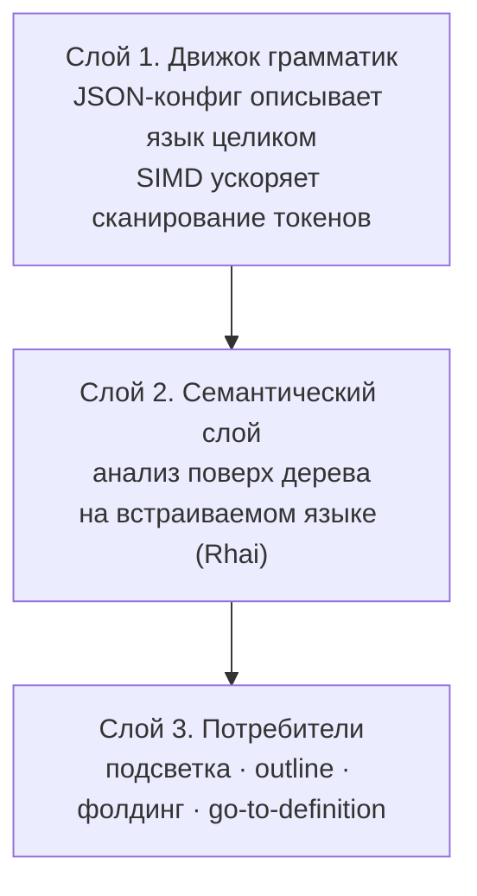
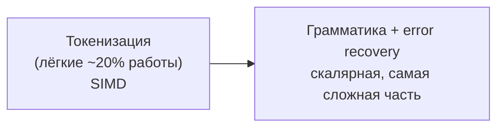

# Parsing-engine

> **О чём документ:** этот документ описывает долгосрочное видение универсального нативного парсинг-движка редактора — три слоя архитектуры, отличие от tree-sitter, ключевой технический вопрос (error recovery), применение SIMD и эволюцию в собственный DSL с компиляцией в WASM.
>
> ⚠️ **ДОКУМЕНТ-ВИДЕНИЕ.** Это долгосрочная идея, а не зафиксированный план работ. Документ **не блокирует MVP** и не входит ни в один из его этапов (см. [`mvp.md`](mvp.md)).

---

## Содержание

1. [Цель: три слоя движка](#цель-три-слоя-движка)
2. [Отличие от tree-sitter](#отличие-от-tree-sitter)
3. [Технический вопрос №1: error recovery](#технический-вопрос-1-error-recovery)
4. [SIMD: где ускорение уместно](#simd-где-ускорение-уместно)
5. [Эволюция в DSL](#эволюция-в-dsl)

---

## Цель: три слоя движка

Цель — **универсальный нативный парсинг-движок**. Не только подсветка синтаксиса:

- полное конфигурируемое построение дерева разбора **любого языка**;
- поверх дерева — LSP-фичи (go-to-definition, outline и т.д.).

Архитектура — три слоя:

| Слой | Ответственность |
|---|---|
| **1. Движок грамматик** | Язык целиком описывается JSON-конфигом; SIMD ускоряет сканирование токенов |
| **2. Семантический слой** | Анализ поверх дерева разбора на встраиваемом языке (Rhai) |
| **3. Потребители** | Всё, что читает дерево: подсветка, outline, фолдинг, go-to-definition и другие |

---

## Отличие от tree-sitter

tree-sitter решает **только слой 1** и только для языков, чьи грамматики записаны на его диалекте.

Отличия подхода parsing-engine:

| | tree-sitter | parsing-engine |
|---|---|---|
| Покрытие слоёв | Только грамматики | Грамматики + семантика + LSP в одном конвейере |
| Описание языка | Собственный диалект грамматик | Конфигурация + семантический слой |
| Упакованное готовое решение | Есть | Аналога почти нет |

Именно отсутствие упакованного аналога «конфиг → дерево → семантика → LSP» делает идею перспективной.

---

## Технический вопрос №1: error recovery

Ключевая техническая проблема: **код в процессе набора всегда невалиден**. Пользователь печатает посреди выражения — парсер обязан работать с недописанным кодом.

Требования к error recovery:

- не падать на невалидном коде;
- не перечитывать весь файл после каждой правки;
- **частичный репарс от точки правки** — перестраивается только затронутая часть дерева.

У tree-sitter эта задача решена дженериком — GLR-разбором, который толерантен к ошибкам по своей природе.

### Открытый вопрос №1: формализм

Выбор формализма грамматик — **открытый вопрос**, решение не принято:

| Формализм | Плюсы | Минусы |
|---|---|---|
| **PEG** | Проще конфигурировать | Слабее в восстановлении после ошибок |
| **GLR** | Мощнее, толерантнее к невалидному коду | Сложнее |

---

## SIMD: где ускорение уместно

Механизм: **классификация байтов через битовые маски**. Прецеденты — [`memchr`](https://github.com/BurntSushi/memchr) и simdjson.

Разделение труда внутри движка:

- **SIMD закрывает токенизацию** — это лёгкие ~20% работы.
- **Грамматика с error recovery остаётся скалярной** и является самой сложной частью движка.

### Реализация SIMD

Замечание о состоянии экосистемы: portable SIMD (`std::simd`) в Rust пока **nightly-only**.

Стабильный путь зафиксирован:

- интринсики `std::arch` (`_mm256_*` для x86 + NEON для ARM);
- runtime-детекция возможностей CPU;
- стиль реализации — как у `memchr`.

---

## Эволюция в DSL

Эволюция движка — трёхшаговая (видение):

1. JSON-грамматики — стартовая точка.
2. Собственный DSL поверх них.
3. Компиляция DSL в нативный код: **транслятор DSL → Rust → WASM**.

Почему трансляция через Rust:

- бэкенд и оптимизации достаются **бесплатно от экосистемы Rust**;
- распространение артефактов — через `.wasm` (см. [`plugins.md`](plugins.md)).

Корректность обеспечивается **по конструкции**: DSL спроектирован так, что невалидный Rust невыразим. Все ошибки ловятся на уровне DSL — с понятными сообщениями об ошибках, а не с диагностикой компилятора Rust.

### Разделение сборки и рантайма

| Компонент | Где живёт |
|---|---|
| wasmtime-рантайм | Внутри редактора |
| Компилятор DSL → WASM | В тулчейне автора плагина |

Редактор содержит только рантайм; автор плагина собирает `.wasm` у себя и публикует готовый артефакт.

### Цели эргономики DSL

| Цель | Значение |
|---|---|
| Уровень языка | Сложность Markdown |
| Объём типовой грамматики | ≈ 200–300 строк DSL |
| Максимальный размер одного файла | до 500–1000 строк |
| API | Декларативный, через константы (виды ручек + типы данных) |
| Документация | Генерируется из тех же метаданных, что описывают API |

### Подготовка к дизайну

Перед проектированием DSL изучить существующие решения: **pest**, **LALRPOP**, **tree-sitter**. Фокус изучения — их больные места: качество диагностики и выразительность.

---

## Связанные документы

- [`plugins.md`](plugins.md) — дистрибуция парсеров, `HighlightProvider`.
- [`mvp.md`](mvp.md) — parsing-engine находится вне MVP.
