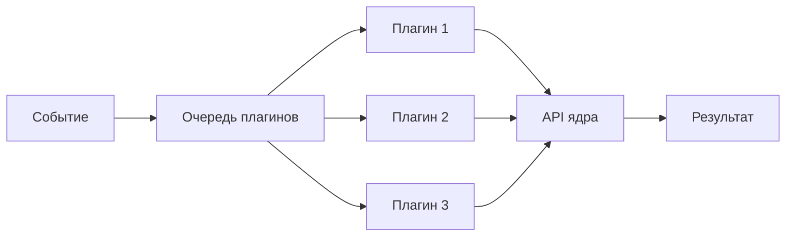
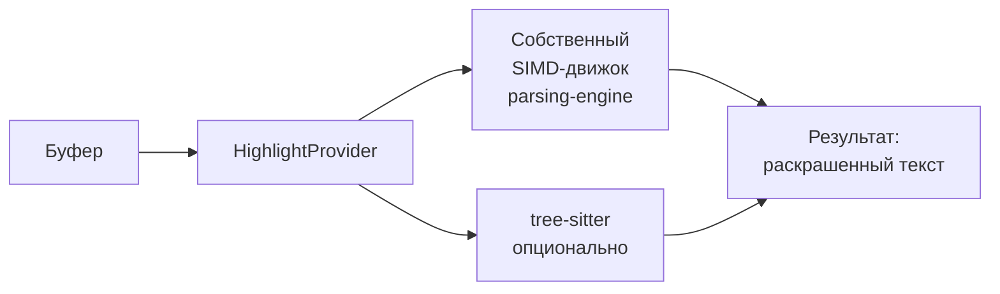

# Плагины и макросы

> **О чём документ:** этот документ описывает двухуровневую систему расширений редактора — TOML-макросы (декларативные последовательности команд) и плагины на Rhai (скриптовый язык как клей, API ядра), жёсткую границу между ними, структуру плагина, асинхронное исполнение и дистрибуцию. Документ фиксирует уже принятые проектные решения.

---

## Содержание

1. [Уровень 1 — TOML-макросы](#уровень-1--toml-макросы)
2. [Жёсткая граница: макросы без логики](#жёсткая-граница-макросы-без-логики)
3. [Уровень 2 — Rhai-плагины](#уровень-2--rhai-плагины)
4. [Структура плагина](#структура-плагина)
5. [Асинхронное исполнение](#асинхронное-исполнение)
6. [Дистрибуция](#дистрибуция)
7. [Подсветка синтаксиса](#подсветка-синтаксиса)
8. [Связь с обучением](#связь-с-обучением)

---

## Уровень 1 — TOML-макросы

Макрос — **именованная последовательность команд с параметрами**, описанная в TOML.

Пример — макрос `duplicate-line` (продублировать текущую строку):

```toml
# Макрос duplicate-line (продублировать текущую строку)
[macro.duplicate-line]
description = "Продублировать текущую строку"
steps = [
    "std::edit::select::line",
    { cmd = "std::clipboard::copy" },
    { cmd = "std::edit::move::down" },
    { cmd = "std::clipboard::paste" },
]
```

### Свойства уровня 1

| Свойство | Следствие |
|---|---|
| **Ноль затрат на язык** | Не нужен ни парсер, ни песочница, ни документация нового синтаксиса |
| **Автодополнение бесплатно** | Макрос попадает в общий реестр команд — автодополнение командной строки работает для него так же, как для `std::...` |
| **Безопасность** | Произвольный код не исполняется в принципе: макрос может вызвать только существующие команды |

Макросы закрывают большой класс потребностей: сниппеты, обёртки над Git, рутинные повторяющиеся действия.

---

## Жёсткая граница: макросы без логики

Граница зафиксирована явно:

> **Макросы декларативны и линейны. В них нет логики: никаких `if`, никаких циклов, никаких переменных.**

Вся логика — только уровень 2 (Rhai-плагины).

Граница должна быть именно **жёсткой**. Если её не зафиксировать, она размоется естественным путём: «ну добавим одну проверочку», потом условный переход, потом переменные — и в TOML родится плохой самодельный язык программирования с непредсказуемой семантикой. Уровень 1 намеренно не Тьюринг-полон.

---

## Уровень 2 — Rhai-плагины

Для задач, требующих логики, используются плагины на **Rhai** — скриптовом языке на чистом Rust.

### Концепция

Модель построена по образцу **Neovim**:

| Neovim | my-editor |
|---|---|
| Lua — язык плагинов | Rhai — язык плагинов |
| Lua как клей | Rhai как клей |
| API ядра на C | API ядра на Rust |
| Плагины на Lua вызывают API ядра | Плагины на Rhai вызывают API ядра |

Rhai — **только клей**. Вся мощь в API ядра. Скрипт не имеет возможностей кроме зарегистрированных функций хоста.

### Выбор Rhai

| Свойство | Значение |
|---|---|
| **Чистый Rust** | Нативная интеграция, без внешних зависимостей |
| **Песочница** | Скрипт изолирован, не имеет доступа к системе |
| **C-подобный синтаксис** | Дружелюбен новичкам, низкий порог входа |
| **Импорт файлов** | Поддержка `import` / `include` для разделения кода на модули |

### Импорт файлов

Rhai поддерживает импорт других скриптов — необязательно сидеть на одном файле:

```rust
// main.rhai
import "utils/format" as fmt;
import "commands/git" as git;

// использование
git.commit("fix: typo");
fmt.align(buffer);
```

Точка входа — `main.rhai`. Остальные файлы подключаются через `import`.

---

## Структура плагина

Плагин — архив `.tar.zst` со строгой структурой:

```
my-plugin.tar.zst
├── manifest.toml     # Обязательный манифест
├── main.rhai         # Скрипт-клей, точка входа
├── docs/             # Обязательная документация
│   └── main.md
└── i18n/             # Переводы интерфейса и документации
    ├── en.toml
    └── ru.toml
```

### manifest.toml

Обязательный файл. Описывает плагин для редактора:

```toml
[plugin]
id = "my-plugin"              # Уникальный идентификатор
version = "0.1.0"             # Версия (semver)
entry = "main.rhai"           # Точка входа
author = "Имя автора"
description = "Краткое описание что делает плагин"
```

### main.rhai

Скрипт-клей. Точка входа плагина. Вызывает API ядра:

```rust
// Регистрация команды
on_command("my-plugin::do-something", |args| {
    let buffer = ctx.current_buffer();
    let cursor = ctx.cursor_pos();
    // логика плагина через API ядра
    ctx.set_buffer(buffer);
});

// Регистрация хоткея
on_key("Ctrl+Shift+D", || {
    ctx.execute("std::edit::duplicate_line");
});
```

### docs/

Обязательная документация в Markdown. Описывает что делает плагин, как настроить, как использовать.

### i18n/

Переводы интерфейса и документации в TOML. Ключи — английские фразы, значения — перевод:

```toml
"My Plugin" = "Мой плагин"
"Description" = "Описание"
```

---

## Асинхронное исполнение

**Все плагины выполняются асинхронно.** Это обязательное требование ядра.

| Требование | Смысл |
|---|---|
| **Неблокирующее исполнение** | Плагин не блокирует ядро и другие плагины |
| **Изолированность** | Падение плагина не влияет на редактор и другие плагины |
| **Очередь** | Плагины выполняются в очереди, не параллельно (избегание гонок) |

### Модель



- Событие (клавиша, команда) попадает в очередь.
- Плагины обрабатывают событие последовательно.
- Каждый плагин работает в своей песочнице Rhai.
- Падение одного плагина не останавливает очередь.

---

## Дистрибуция

Плагины распространяются по образцу [`lazy.nvim`](https://github.com/folke/lazy.nvim): **скачивание готовых архивов с GitHub прямо из редактора**.

Схема:

1. Автор публикует артефакт под тегом или хешем коммита.
2. Редактор скачивает артефакт изнутри себя.
3. Целостность скачивания проверяется.

### Категории контента

Загружаемый контент разделяется на категории:

| Категория | Назначение |
|---|---|
| **Парсеры** | Грамматики языков для движка парсинга ([`parsing-engine.md`](parsing-engine.md)) |
| **Плагины** | Расширения поведения (уровни 1–2) |
| **LSP** | Интеграция с серверами языковых протоколов |

Один парсер может покрывать и подсветку, и LSP сам — соответствующая логика живёт внутри него; отдельные категории не дублируют работу друг друга принудительно.

---

## Подсветка синтаксиса

Подсветка построена через интерфейс `HighlightProvider`. За интерфейсом — разные провайдеры:



- **Основной провайдер** — собственный SIMD-движок (см. [`parsing-engine.md`](parsing-engine.md)).
- **Опциональный провайдер** — tree-sitter для простых случаев типа конфигурационных файлов.

**Решение о tree-sitter будет принято после бенчмарка против SIMD-движка** — tree-sitter остаётся в проекте только если выиграет по измеримым показателям там, где его предполагается использовать.

---

## Связь с обучением

Обучающий курс ([`tutorial.md`](tutorial.md)) связан с макросами напрямую: уроки предлагают пользователю **записать последовательность действий как макрос и повесить алиас**. Так обучение сразу даёт навык автоматизации рутины, а не только навигации.

---

## Связанные документы

- [`parsing-engine.md`](parsing-engine.md) — движок парсинга и подсветки.
- [`command-system.md`](command-system.md) — реестр команд, в который попадают макросы.
- [`tutorial.md`](tutorial.md) — связь уроков обучения с записью макросов.
