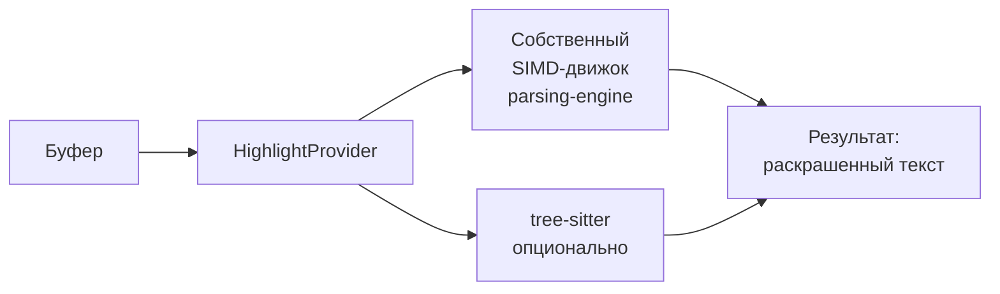

# Плагины и макросы

> **О чём документ:** этот документ описывает двухуровневую систему расширений редактора — RON-макросы (декларативные последовательности команд) и встраиваемый язык для логики, жёсткую границу между ними, дистрибуцию плагинов и подсветку синтаксиса как подключаемый интерфейс. Документ фиксирует уже принятые проектные решения; выбор конкретного встраиваемого языка осознанно отложен.

---

## Содержание

1. [Уровень 1 — RON-макросы](#уровень-1--ron-макросы)
2. [Жёсткая граница: макросы без логики](#жёсткая-граница-макросы-без-логики)
3. [Уровень 2 — встраиваемый язык](#уровень-2--встраиваемый-язык)
4. [Дистрибуция](#дистрибуция)
5. [Подсветка синтаксиса](#подсветка-синтаксиса)
6. [Связь с обучением](#связь-с-обучением)

---

## Уровень 1 — RON-макросы

Макрос — **именованная последовательность команд с параметрами**, описанная в RON.

Пример — макрос `duplicate-line` (продублировать текущую строку):

```ron
// Макрос duplicate-line (продублировать текущую строку)
(
    description: "Продублировать текущую строку",
    steps: [
        "std::edit::select::line",
        (cmd: "std::clipboard::copy"),
        (cmd: "std::edit::move::down"),
        (cmd: "std::clipboard::paste"),
    ],
)
```

### Свойства уровня 1

| Свойство | Следствие |
|---|---|
| **Ноль затрат на язык** | Не нужен ни парсер, ни песочница, ни документация нового синтаксиса |
| **Автодополнение бесплатно** | Макрос попадает в общий реестр команд — автодополнение командной строки работает для него так же, как для `std::...` |
| **Безопасность** | Произвольный код не исполняется в принципе: макрос может вызвать только существующие команды |

Макросы закрывают большой класс потребностей: сниппеты, обёртки над Git, рутинные повторяющиеся действия.

---

## Жёсткая граница: макросы без логики

Граница зафиксирована явно:

> **Макросы декларативны и линейны. В них нет логики: никаких `if`, никаких циклов, никаких переменных.**

Вся логика — только уровень 2 (встраиваемый язык).

Граница должна быть именно **жёсткой**. Если её не зафиксировать, она размоется естественным путём: «ну добавим одну проверочку», потом условный переход, потом переменные — и в RON родится плохой самодельный язык программирования с непредсказуемой семантикой. Уровень 1 намеренно не Тьюринг-полон.

---

## Уровень 2 — встраиваемый язык

Для задач, требующих логики, предусмотрен встраиваемый язык. Выбор между кандидатами **осознанно отложен до реальных сценариев использования** — решение будет принято на практике, а не заранее.

### Кандидаты

| Кандидат | Сильные стороны | Слабые стороны |
|---|---|---|
| **Rhai** | Чистый Rust; песочница по конструкции — скрипт не имеет возможностей кроме зарегистрированных функций хоста; C-подобный синтаксис дружелюбен новичкам | — |
| **Steel** | Scheme на чистом Rust (выбор Helix); быстрее Rhai | Lisp-синтаксис повышает порог входа для новичков |
| **WASM / wasmtime** | Железная изоляция рантайма | Автору плагина нужен тулчейн для сборки |

Критерий, вокруг которого строится любой выбор: **принцип обоих уровней**.

> **Принцип:** макросы и скрипты уровня 2 вызывают одни и те же команды редактора. Второй уровень не открывает «заднюю дверь» к внутренностям — он лишь добавляет логику поверх того же API команд.

---

## Дистрибуция

Плагины распространяются по образцу [`lazy.nvim`](https://github.com/folke/lazy.nvim): **скачивание готовых `.wasm`-бинарников с GitHub прямо из редактора**.

Схема:

1. Автор публикует артефакт под тегом или хешем коммита.
2. Редактор скачивает артефакт изнутри себя.
3. Целостность скачивания проверяется.

### Категории контента

Загружаемый контент разделяется на категории:

| Категория | Назначение |
|---|---|
| **Парсеры** | Грамматики языков для движка парсинга ([`parsing-engine.md`](parsing-engine.md)) |
| **Плагины** | Расширения поведения (уровни 1–2) |
| **LSP** | Интеграция с серверами языковых протоколов |

Один парсер может покрывать и подсветку, и LSP сам — соответствующая логика живёт внутри него; отдельные категории не дублируют работу друг друга принудительно.

---

## Подсветка синтаксиса

Подсветка построена через интерфейс `HighlightProvider`. За интерфейсом — разные провайдеры:



- **Основной провайдер** — собственный SIMD-движок (см. [`parsing-engine.md`](parsing-engine.md)).
- **Опциональный провайдер** — tree-sitter для простых случаев типа конфигурационных файлов.

**Решение о tree-sitter будет принято после бенчмарка против SIMD-движка** — tree-sitter остаётся в проекте только если выиграет по измеримым показателям там, где его предполагается использовать.

---

## Связь с обучением

Обучающий курс ([`tutorial.md`](tutorial.md)) связан с макросами напрямую: уроки предлагают пользователю **записать последовательность действий как макрос и повесить алиас**. Так обучение сразу даёт навык автоматизации рутины, а не только навигации.

---

## Связанные документы

- [`parsing-engine.md`](parsing-engine.md) — движок парсинга и подсветки.
- [`command-system.md`](command-system.md) — реестр команд, в который попадают макросы.
- [`tutorial.md`](tutorial.md) — связь уроков обучения с записью макросов.
